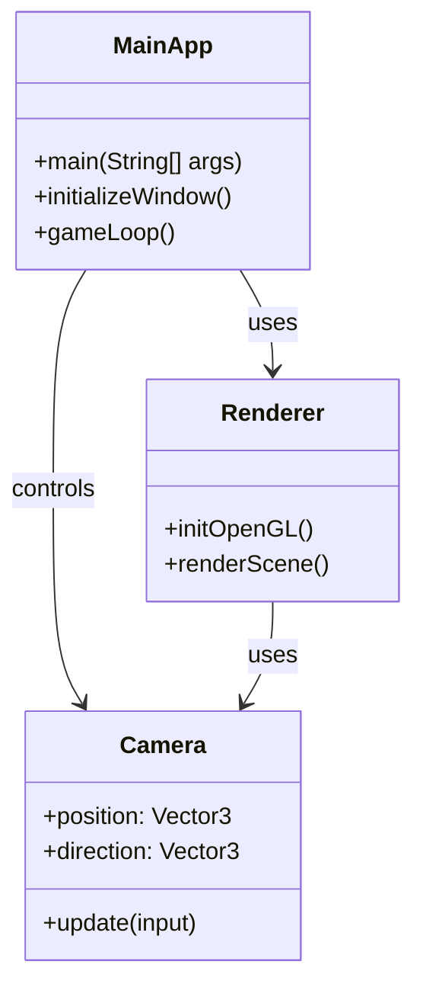

# Architecture Specification: 3D FPS Desktop App

## Description
- **MainApp**: Entry point, sets up the window and main game loop.
- **Renderer**: Handles all OpenGL rendering.
- **Camera**: Manages first person camera position and orientation.

*This architecture is intentionally minimal to support the MVP: an empty 3D world with first person camera controls.*
