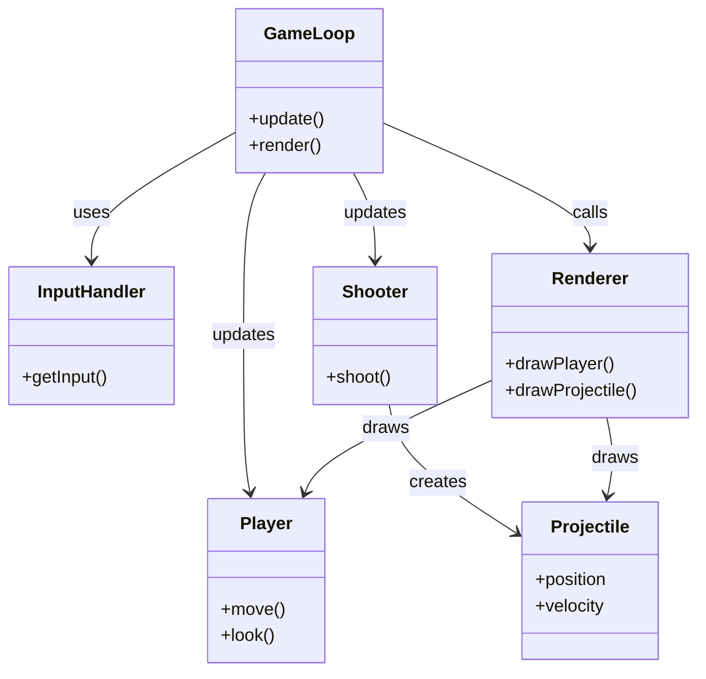

# FPS Game Architecture (Mermaid UML)

```mermaid
classDiagram
    class GameLoop {
        +update()
        +render()
    }
    class Player {
        +move()
        +look()
    }
    class InputHandler {
        +getInput()
    }
    class Shooter {
        +shoot()
    }
    class Projectile {
        +position
        +velocity
    }
    class Renderer {
        +drawPlayer()
        +drawProjectile()
    }

    GameLoop --> Player : updates
    GameLoop --> Shooter : updates
    GameLoop --> Renderer : calls
    GameLoop --> InputHandler : uses
    Shooter --> Projectile : creates
    Renderer --> Player : draws
    Renderer --> Projectile : draws
```

This diagram shows the basic relationships and responsibilities of the main components in the FPS game as described in the project specification.
