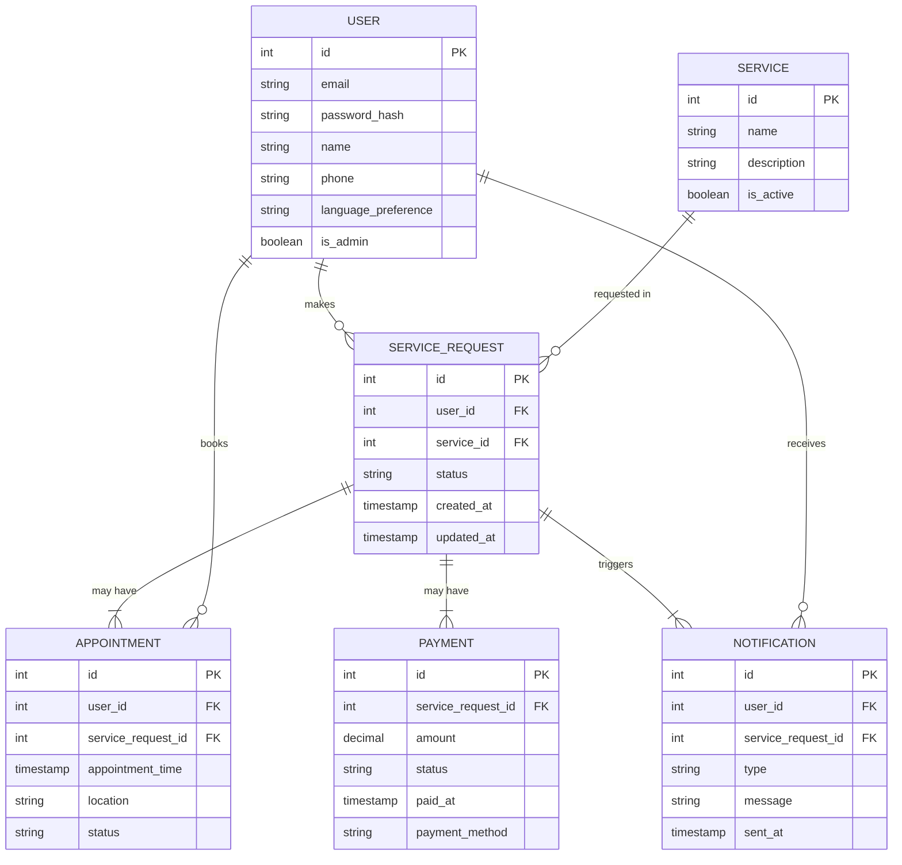

## Data Schema

```mermaid
erDiagram
    USER {
        int id PK
        string email
        string password_hash
        string name
        string phone
        string language_preference
        boolean is_admin
    }
    SERVICE {
        int id PK
        string name
        string description
        boolean is_active
    }
    SERVICE_REQUEST {
        int id PK
        int user_id FK
        int service_id FK
        string status
        timestamp created_at
        timestamp updated_at
    }
    APPOINTMENT {
        int id PK
        int user_id FK
        int service_request_id FK
        timestamp appointment_time
        string location
        string status
    }
    PAYMENT {
        int id PK
        int service_request_id FK
        decimal amount
        string status
        timestamp paid_at
        string payment_method
    }
    NOTIFICATION {
        int id PK
        int user_id FK
        int service_request_id FK
        string type
        string message
        timestamp sent_at
    }

    USER ||--o{ SERVICE_REQUEST : "makes"
    SERVICE ||--o{ SERVICE_REQUEST : "requested in"
    SERVICE_REQUEST ||--|{ APPOINTMENT : "may have"
    SERVICE_REQUEST ||--|{ PAYMENT : "may have"
    SERVICE_REQUEST ||--|{ NOTIFICATION : "triggers"
    USER ||--o{ APPOINTMENT : "books"
    USER ||--o{ NOTIFICATION : "receives"
```

